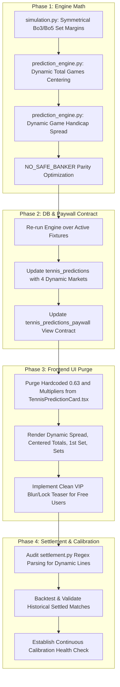

# 4-Phased Implementation Plan: Dynamic Tennis Predictions & UI Calibration

This plan transitions the Tennis Prediction system from static fallbacks (`63.0%`, formulaic multipliers, and fixed 21.5 lines) to fully dynamic, mathematically sound primary and secondary betting predictions.

Each phase has a dedicated **Accuracy Verification Test** and requires **your explicit approval** before proceeding to the next.

---

## Architecture Flow Overview

---

## Phase 1: Python Engine Math Modeling & Symmetrical Secondary Predictions

### Objective
Ensure that every simulated match outputs 4 distinct, statistically grounded, and dynamically line-centered secondary markets with zero hardcoded thresholds.

### Detailed Scope:
1. **Symmetrical Set Handicap Modeling (`simulation.py`)**:
   - Compute set margins symmetrically for both Player 1 and Player 2.
   - For **Best of 3**:
     - Favorite $-1.5$ Sets = $P(\text{Fav Sets} = 2 \land \text{Dog Sets} = 0)$.
     - Underdog $+1.5$ Sets = $1.0 - P(\text{Fav Sets} = 2 \land \text{Dog Sets} = 0)$.
   - For **Best of 5 (Grand Slams)**:
     - Favorite $-1.5$ Sets = $P(\text{Fav Sets} = 3 \land \text{Dog Sets} \le 1)$ (wins 3-0 or 3-1).
     - Underdog $+1.5$ Sets = $1.0 - P(\text{Fav Sets} = 3 \land \text{Dog Sets} \le 1)$.
   - Fixes the bug where Player 2 set handicap evaluated to `0.0%` in Grand Slams.
2. **Dynamic Total Games Line Centering (`prediction_engine.py`)**:
   - Discard the static `21.5` / `22.5` line logic.
   - Extract the median/mean total games from the 250,000 simulation draw array (`sim_res.expected_total_games`).
   - Round to the nearest half-game line (e.g. `19.5`, `22.5`, `24.5` for Bo3; `36.5`, `38.5` for Bo5).
   - Evaluate empirical probability $P(\text{Total} > \text{Line})$ vs $P(\text{Total} < \text{Line})$ and select the side with the statistically validated edge.
3. **Include the Game Handicap Spread (`prediction_engine.py`)**:
   - Replace the redundant secondary `match_winner` slot with the **Game Handicap Spread** (e.g. `Favorite -3.5 Games` or `Underdog +3.5 Games`).
   - Derive the line directly from `sim_res.game_handicaps` centered on `sim_res.expected_game_margin`.
4. **Intelligent Coin-Flip Handling (`NO_SAFE_BANKER`)**:
   - When a match is flagged as `NO_SAFE_BANKER` ($fav\_win\_prob < 58\%$), suppress straight-set sweep picks ($25\%$).
   - Substitute high-probability parity markets:
     - **Over 2.5 Sets / Both Players to Win a Set** ($P(1-2 \text{ or } 2-1)$).
     - **Underdog +1.5 Sets**.

### Phase 1 Verification & Accuracy Test:
* Create a dedicated simulation validation test running across 4 benchmark match archetypes:
  1. *Heavy Favorite Bo3* (e.g. Alcaraz vs unranked: line should center around 18.5–19.5, high -1.5 set prob).
  2. *Server Duel Bo3* (e.g. Hurkacz vs big server: line should center around 24.5–25.5, lower set sweep prob).
  3. *Grand Slam Bo5* (e.g. Sinner vs Medvedev: line should center around 36.5–39.5, valid P2 Bo5 handicap).
  4. *Even Coin Flip* (e.g. 50/50 match: line outputs Over sets / Dog +1.5 sets, no 25% sweep picks).
* Output a detailed mathematical distribution report confirming all 4 markets have realistic, calibrated probabilities ($52\%$ to $85\%$) and zero 0.0% or 99.9% anomalies.

> [!IMPORTANT]
> **Approval Gate 1**: You will inspect the mathematical test report and verify the 4 archetype outputs before any database changes are made.

---

## Phase 2: Database Storage, Pipeline Refresh & Paywall Contract

### Objective
Populate the cloud database with genuine dynamic secondary predictions for all upcoming fixtures, and align the paywall view so that unauthenticated/free requests do not trigger client-side data fabrications.

### Detailed Scope:
1. **Batch Prediction Engine Execution**:
   - Run the updated prediction engine over all upcoming active tennis tournament fixtures.
   - Upsert verified dynamic `secondary_predictions` payloads and expanded `metadata` into `public.tennis_predictions`.
2. **Refine Paywall View Contract (`tennis_predictions_paywall`)**:
   - Currently, `tennis_predictions_paywall` replaces `secondary_predictions` with `'[]'::jsonb` for free users on upcoming matches.
   - Refactor the view to return a structured paywall teaser for free users (e.g. returning market names with `locked: true`, or blurred probabilities) rather than an empty array.
   - This ensures the frontend receives clear signals: *"These are locked premium markets"* instead of *"This record has missing data"*.

### Phase 2 Verification & Accuracy Test:
* Query `tennis_predictions` via Supabase API across active tournaments:
  - Verify 100% of upcoming fixtures contain 4 dynamic secondary markets with zero empty arrays.
  - Query `tennis_predictions_paywall` as an unauthenticated guest to verify that security rules properly protect VIP data without breaking the data schema.

> [!IMPORTANT]
> **Approval Gate 2**: You will review the Supabase data records and paywall responses to confirm database integrity before moving to the frontend.

---

## Phase 3: Frontend UI Modernization & Zero-Fallback Purge

### Objective
Purge all synthetic client-side fallbacks (`63.0%`, formulaic multipliers, `'88.5%'`) from the UI and render authentic, dynamic market cards with clean VIP lock states.

### Detailed Scope:
1. **Remove Hardcoded Fallbacks in `TennisPredictionCard.tsx`**:
   - Completely delete lines 122–155 where static `probability: 0.63`, `favWinProb * 0.85`, and `favWinProb * 0.92` are computed.
   - Remove the hardcoded `'88.5%'` string fallback on line 573.
2. **Display the 4 Calibrated Markets**:
   - `⚡ Game Handicap (Spread)`: e.g. `Alcaraz -4.5 Games` ($64.2\%$).
   - `🎾 Total Games (O/U)`: e.g. `Over 22.5 Games` ($59.1\%$).
   - `🥇 1st Set Winner`: e.g. `Alcaraz 1st Set` ($68.5\%$).
   - `🎯 Set Handicap / Over Sets`: e.g. `Alcaraz -1.5 Sets` ($61.0\%$) or `Over 2.5 Sets` ($56.3\%$).
3. **Paywall UX for Free / Guest Users**:
   - If a free user views a locked card, show the genuine market names with an elegant blur/lock overlay (`🔒 VIP Banker`) rather than fabricating fake percentages.

### Phase 3 Verification & Accuracy Test:
* Inspect the live frontend at `http://localhost:5173/tennis` using Chrome DevTools/browser automation:
  - Verify that the static `63.0%` figure is completely absent across all tournament cards.
  - Verify that each match displays distinct, dynamic lines (e.g. 19.5, 22.5, 24.5).
  - Test the view as both a Guest/Free user and a VIP Subscriber to verify seamless UX in both states.

> [!IMPORTANT]
> **Approval Gate 3**: You will review the visual UI in the browser and confirm that all static figures have disappeared and dynamic data displays properly.

---

## Phase 4: Autonomous Settlement Verification & Historical Calibration

### Objective
Ensure that dynamic lines are autonomously settled against official ATP/WTA match results with high accuracy and zero settlement mismatches.

### Detailed Scope:
1. **Settlement Engine Line Verification (`python/src/tennis/settlement.py`)**:
   - Audit regex and line parsing for `total_games_over_under`, `game_handicap`, `set_handicap`, and `first_set_winner` against variable lines (e.g. `Over 19.5`, `Over 24.5`, `+3.5 Games`).
   - Confirm proper settlement under ATP/WTA retirement and walkover rules.
2. **Historical Backtest & Accuracy Calibration**:
   - Run a settlement dry-run on recently finished tennis matches using the dynamic engine.
   - Calculate the empirical win rate across all 4 secondary markets.
3. **Continuous Accuracy Monitor**:
   - Add automated schema validation so any future engine run automatically fails if a secondary prediction lacks dynamic lines or falls back to static defaults.

### Phase 4 Verification & Accuracy Test:
* Execute `settlement.py` in test mode against settled tournament results.
* Generate a comprehensive settlement audit report showing match-by-match evaluation, won/lost distribution, and confirmed settlement accuracy.

> [!IMPORTANT]
> **Approval Gate 4**: Final review of the settlement audit report for sign-off.
